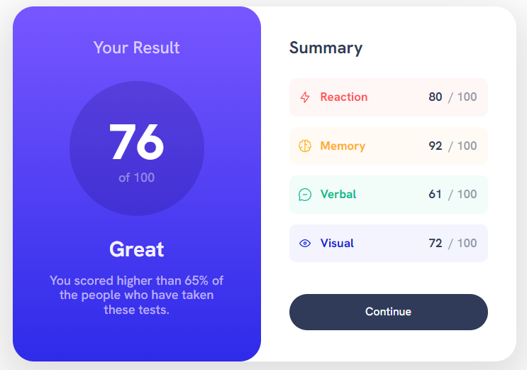
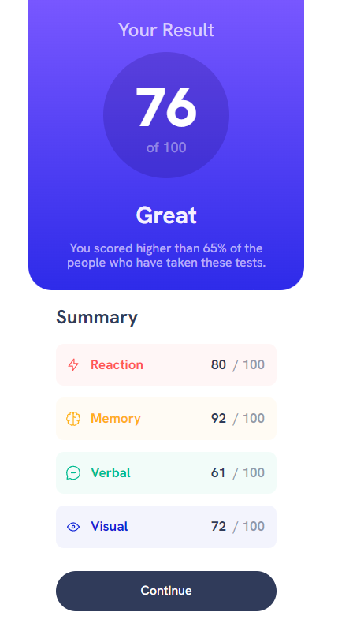

# Frontend Mentor - QR code component solution

This is a solution to the [Results summary component challenge on Frontend Mentor](https://www.frontendmentor.io/challenges/results-summary-component-CE_K6s0maV). Frontend Mentor challenges help you improve your coding skills by building realistic projects. 

## Table of contents

- [Overview](#overview)
  - [Screenshot](#screenshot)
- [My process](#my-process)
  - [Built with](#built-with)
- [Author](#author)

## Overview

### Screenshot

### Links

- Solution URL: https://github.com/gzeta24/Results-Summary-Component/
- Live site: https://gzeta24.github.io/Results-Summary-Component/

## My process

### Built with

- Semantic HTML5 markup
- CSS custom properties

## Author

- Giuliano Suarez
- Frontend Mentor - [@gzeta24](https://www.frontendmentor.io/profile/gzeta24)
